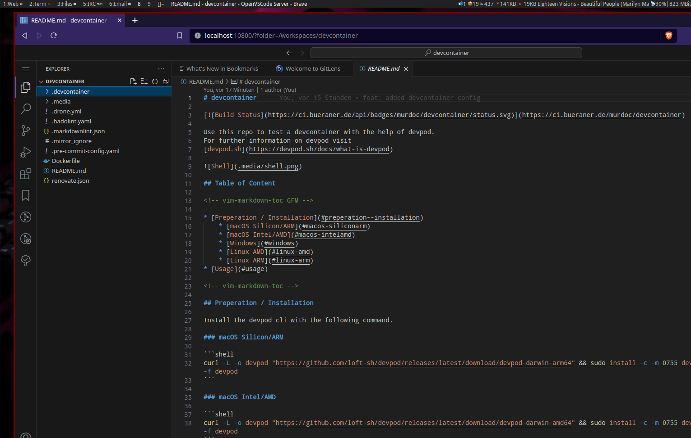
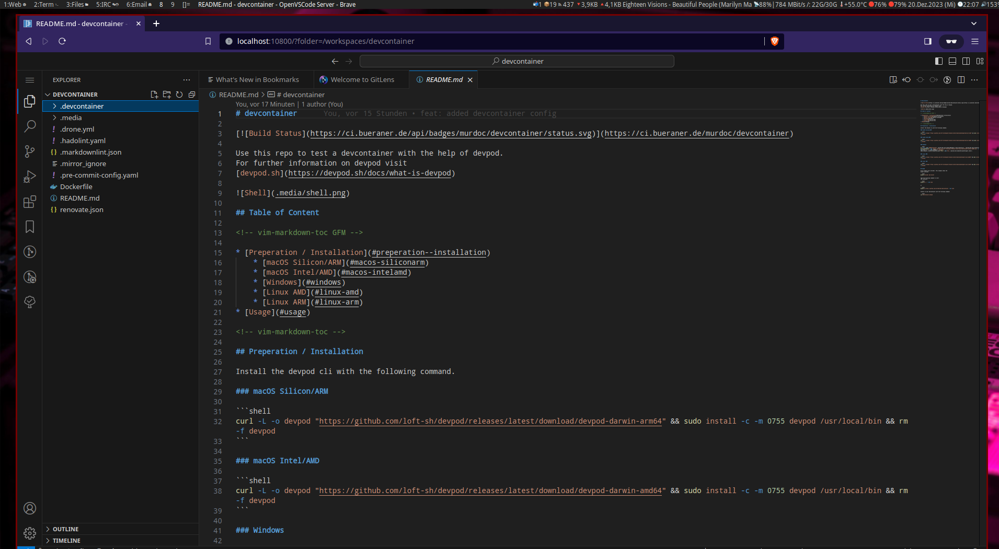

# devcontainer

[](https://ci.bueraner.de/murdoc/devcontainer)

Use this repo to test a devcontainer with the help of devpod.
For further information on devpod visit
[devpod.sh](https://devpod.sh/docs/what-is-devpod)



## Table of Content

<!-- vim-markdown-toc GFM -->

* [Preperation / Installation](#preperation--installation)
    * [macOS Silicon/ARM](#macos-siliconarm)
    * [macOS Intel/AMD](#macos-intelamd)
    * [Windows](#windows)
    * [Linux AMD](#linux-amd)
    * [Linux ARM](#linux-arm)
* [Usage](#usage)
* [Provider Inactivity Timeout](#provider-inactivity-timeout)
* [Provider Options](#provider-options)
* [Mirror](#mirror)

<!-- vim-markdown-toc -->

## Preperation / Installation

Install the devpod cli with the following command.

### macOS Silicon/ARM

```shell
curl -L -o devpod "https://github.com/loft-sh/devpod/releases/latest/download/devpod-darwin-arm64" && sudo install -c -m 0755 devpod /usr/local/bin && rm -f devpod
```

### macOS Intel/AMD

```shell
curl -L -o devpod "https://github.com/loft-sh/devpod/releases/latest/download/devpod-darwin-amd64" && sudo install -c -m 0755 devpod /usr/local/bin && rm -f devpod
```

### Windows

```shell
md -Force "$Env:APPDATA\devpod"; [System.Net.ServicePointManager]::SecurityProtocol = [System.Net.SecurityProtocolType]'Tls,Tls11,Tls12';
Invoke-WebRequest -URI "https://github.com/loft-sh/devpod/releases/latest/download/devpod-windows-amd64.exe" -o $Env:APPDATA\devpod\devpod.exe;
$env:Path += ";" + $Env:APPDATA + "\devpod";
[Environment]::SetEnvironmentVariable("Path", $env:Path, [System.EnvironmentVariableTarget]::User);
```

### Linux AMD

```shell
curl -L -o devpod "https://github.com/loft-sh/devpod/releases/latest/download/devpod-linux-amd64" && sudo install -c -m 0755 devpod /usr/local/bin && rm -f devpod
```

### Linux ARM

```shell
curl -L -o devpod "https://github.com/loft-sh/devpod/releases/latest/download/devpod-linux-arm64" && sudo install -c -m 0755 devpod /usr/local/bin && rm -f devpod
```

## Usage

First prepare your provider. This example shows the
docker provider.

```shell
devpod provider add docker
```

Type the following command to start
the container.

```shell
devpod up ./ --ide none
```

or

```shell
devpod up https://github.com/stormmurdoc/devcontainer --ide none
```

Currently the following IDEs are supported:

* clion
* fleet
* goland
* intellij
* jupyternotebook
* none
* openvscode
* phpstorm
* pycharm
* rider
* rubymine
* vscode
* webstorm

The following command start your vscode and connect remotely to your
development container.

```shell
devpod up https://github.com/stormmurdoc/devcontainer --ide vscode
```

The IDE option `openvscode` starts a VSCODE instance in your local
browser.



Connect to your devcontainer with the following command:

```shell
ssh devcontainer.devpod
```

## Provider Inactivity Timeout

Automatically shutdown unused workspaces to save costs with the following
provider option. The following command sets the timeout to 10min for
the ssh provider.

```shell
devpod provider update ssh -o INACTIVITY_TIMEOUT=10m
```

## Provider Options

You can list the table of provider's options by using

```shell
devpod provider options ssh
```

## Mirror

This repo is only a mirror from a private gitea instance.
